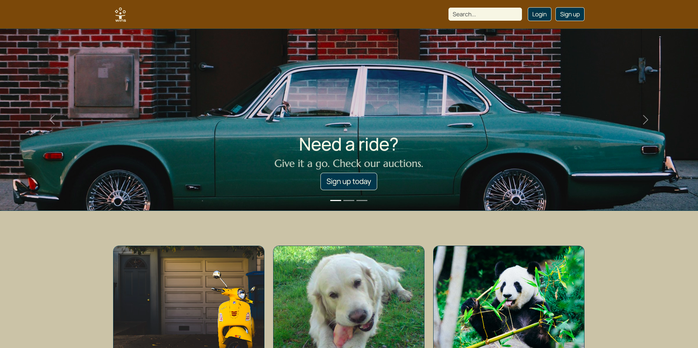

# _Wins!_ - a website with auctions



## Project Description

_Wins!_ is a project created to be used as an auction site. The landing site shows 100 auctions and enables user to search through them and check the details of each of those. However, only registered and logged in users are able to place theirs bids to the chosen auction(s). In addition, the user that is logged in, has a possibility to change their avatar, start a new auction (adding name of the object, its short description, tags, images and end-date) as well as edit or delete their auctions.

Since _Wins!_ is a school project that was handed in whinin a certain deadline, there is still many things that should be improved in the future, like adding the filter-function or a possibility to see more auctions than 100.

## _Wins!_ was built with:

- HTML;
- CSS + SCSS;
- JS;
- Bootstrap;
- Husky;
- Eslint;
- Babel;
- Vite;
- Jest;

## How to run a project:

Clone and open repository: https://github.com/AnnaAWojtowicz/SemesterProject2 and run in Terminal:

```
npm install
npm run dev
```

## Sources:

### Brief:

Noroff (n.a.) Semester Project 2 brief. Retrieved 14.11.2023 from:

### Websites:

Stack Overflow (24.07.2022) How do I create a GUID / UUID?.Retrieved 11.12.2023 from: https://stackoverflow.com/a/2117523;
Stack Overflow (22.06.2020) Generate random string/characters in JavaScript. Retrieved 11.12.2023 from: https://stackoverflow.com/a/8084248;
Vite (n.a.) GitHub Pages. Retrieved 11.12.2023 from: https://vitejs.dev/guide/static-deploy#github-pages;

### Images:

Alexander, C. (17.01.2017). No title [A car on a street]. Retrieved 11.12.2023 from: https://unsplash.com/photos/classic-teal-sedan-near-brown-brick-building-at-daytime-2ct89Ann_lk;

Delberghe, J.P. (27.10.2018). No title [A sofa]. Retrived 14.12.2023 from: https://unsplash.com/photos/vacant-brown-fabric-sofa-T5BF4OyQLwU;

Dera, A. (30.09.2017). No title [A young man]. Retrived 16.12.2023 from: https://unsplash.com/photos/mans-grey-and-black-shirt-ILip77SbmOE;

Jangid, K. (10.08.2019) No title [An Instax-camera]. Retrived 16.12.2023 from: https://unsplash.com/photos/person-holding-pin-camera-uxyDYuZJwXg;

Khan, S (29. 09.2001) (29.01.2019) No title [A room]. Retrived 16.12.2023 from:
https://unsplash.com/photos/a-living-room-filled-with-furniture-and-a-book-shelf-8MJqNBSymRE;

Larin, M. (04.02.2019) No title [A shoe]. Retrived 16.12.2023 from: https://unsplash.com/photos/brown-nike-sneaker-on-yellow-textile-NOpsC3nWTzY;

Nekoranec, P. (29.01.2019) No title [A photo]. Retrived 16.12.2023 from: https://unsplash.com/photos/person-holds-photo-of-building-lMITPabVlvY;

Pacto Visual (02.11.2016). No title [A cat]. Retrived 16.12.2023 from:
https://unsplash.com/photos/close-up-photo-of-tabby-cat-cWOzOnSoh6Q;

Rayyu (03.03.2020) No title [A bicycle]. Retrived 16.12.2023 from:
https://unsplash.com/photos/white-bicycle-on-brown-wooden-dock-during-daytime-i-rETD5k1Qk;

Robertson, E. (10.09.2016). No title [A cat]. Retrived 16.12.2023 from: https://unsplash.com/photos/black-ray-ban-wayfarer-sunglasses-on-beach-sand-SYx3UCHZJlo;

Saldaña, P.G. (19.05.2019). No title [A sign showing two directions]. Retrieved 14.12.2023 from: https://unsplash.com/photos/yellow-arrow-road-sign-lPQIndZz8Mo;

Seth, S. (10.06.2001). No title [A sofa]. Retrived 14.12.2023 from: https://unsplash.com/photos/gray-cushion-armchair-beside-white-wall-CgjBaRKroEY;

Setyadi, H. (14.02.2020) No title [A t-shirt]. Retrived 16.12.2023 from: https://unsplash.com/photos/white-crew-neck-t-shirt-acn5ERAeSb4;

Sporys, M.A. (06.11.2017). No title [Foot of a woman and a man]. Retrieved 11.12.2023 from: https://unsplash.com/photos/two-people-standing-on-brown-wooden-floor-NO8Sj4dKE8k;

Taylor, P. (27.04.2018) No title [A watch]. Retrived 16.12.2023 from: https://unsplash.com/photos/round-silver-colored-chronograph-watch-with-brown-leather-strap-12V36G17IbQ;

Weisser, S. (27.07.2019). No title [An electric guitar]. Retrieved 11.12.2023 from: https://unsplash.com/photos/teal-and-brown-electric-guitar-phS37wg8cQg;

### Fonts:

Marcellus: https://fonts.google.com/specimen/Marcellus?query=Marcellus;

Manrope: https://fonts.google.com/specimen/Manrope?query=Manrope;

### Other:

Vinh Bui (n.a.). Bootstrap 5 Design System - UI Kit. Retrieved 25.11.2023 from: https://www.figma.com/community/file/1044316192441037087
